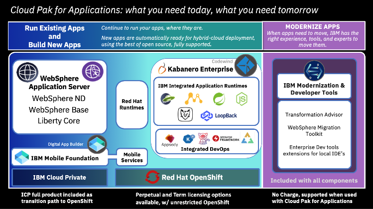

---

copyright:
  years: 2019, 2021
lastupdated: "2021-04-27"

subcollection: cloud-pak-applications
---

{:shortdesc: .shortdesc}
{:codeblock: .codeblock}
{:pre: .pre}
{:screen: .screen}
{:tip: .tip}
{:note: .note}
{:external: target="_blank" .external}

# About
{: #about}

This information applies to {{site.data.keyword.icpa_rm}} version 4.3.x on {{site.data.keyword.cloud}}. For information about version 5.1.x, see the [IBM {{site.data.keyword.icpa_short}} 5.1.x documentation](https://www.ibm.com/docs/cloud-paks/cp-applications/5.1?topic=installing){: external}.
{: note}

{{site.data.keyword.icpa_rm}} is an enterprise-ready, containerized software solution for modernizing existing applications and developing new cloud-native apps that run on {{site.data.keyword.redhat_full}} OpenShift&reg;.
{: shortdesc}

 Built on {{site.data.keyword.IBM_notm}} WebSphere&reg; offerings and {{site.data.keyword.redhat_notm}} {{site.data.keyword.openshiftshort}} Container Platform with {{site.data.keyword.IBM_notm}} {{site.data.keyword.ke}}, {{site.data.keyword.icpa_short}} provides a long-term solution to help you transition between public, private, and hybrid clouds, and create new business applications. {{site.data.keyword.icpa_short}} also provides:
 - Modernization tools such as {{site.data.keyword.cloud}} {{site.data.keyword.ta_short}} to assist with your move to the cloud.
 - Developer tools such as Eclipse Codewind (deprecated) to build and deploy your new cloud-native applications with the IDE of your choice.
 - Entitlement to IBM Cloud Private to provide a transition path to {{site.data.keyword.redhat_notm}} {{site.data.keyword.openshiftshort}}.

<!--  -->

## Benefits
{: #benefits}

- Develop innovative cloud-native applications with the tools and runtime of your choice.  
- Modernize your applications faster and make them more secure. {{site.data.keyword.icpa_short}} speeds development of applications that are built for Kubernetes to access cloud services.
- Run your existing applications where they are, and deploy your modernized and new cloud-native applications to the cloud in containers.

Learn more about {{site.data.keyword.icpa_short}} and what it can do for your business at the [{{site.data.keyword.icpa}}](https://www.ibm.com/cloud/cloud-pak-for-applications){: external} website.

## Bundled products included with {{site.data.keyword.icpa}}

{{site.data.keyword.icpa_short}} provides several software offerings in one bundle.

### {{site.data.keyword.IBM_notm}} {{site.data.keyword.appserver_short}}
{: #was}
{{site.data.keyword.appserver_short}}, with its traditional and Liberty runtimes, offers industry-leading, production-ready, standards-based Java&trade; EE-compliant architectures. Cloud Pak for Applications include {{site.data.keyword.appserver_short}} ND, {{site.data.keyword.appserver_short}}, and the WebSphere Liberty Core editions with the ability to easily mix and match between them.

### {{site.data.keyword.IBM_notm}} {{site.data.keyword.mobilefoundation_short}}
{: #mobile}
{{site.data.keyword.IBM_notm}} {{site.data.keyword.mobilefoundation_short}} offers a secured platform for developers to rapidly build and deploy the next generation of digital apps, including mobile, wearables, conversation, web, and PWAs. With Mobile Foundation, developers get containerized mobile back-end services that cover comprehensive security, application lifecycle management, push notifications, feature toggle, offline sync, and back-end integration. The platform also ships a low-code studio, private appstore, and rich SDKs for widely used mobile frameworks for both native and hybrid developers. Learn more at the [Mobile Foundation Services website](http://mobilefirstplatform.ibmcloud.com/tutorials/en/mobileservices-icpa/){: external}.

### IBM Cloud Private
{: #cpriv}

IBM Cloud Private is a private cloud platform that provides the benefits of the public cloud from the safety of your firewall-protected data center. With the acquisition of {{site.data.keyword.redhat_notm}}, {{site.data.keyword.IBM_notm}} is standardizing on {{site.data.keyword.redhat_notm}} {{site.data.keyword.openshiftshort}} Container Platform as its platform for cloud native, container based, Kubernetes orchestration. Entitlement to IBM Cloud Private is included in {{site.data.keyword.icpa_short}} to facilitate the transition to {{site.data.keyword.openshiftshort}}.

### {{site.data.keyword.redhat_notm}} {{site.data.keyword.openshiftshort}} Container Platform
{: #ocp}
{{site.data.keyword.redhat_notm}} {{site.data.keyword.openshiftshort}} delivers a comprehensive solution for hybrid cloud, enterprise container, and Kubernetes development and deployments. It includes an enterprise-grade Linux&reg; operating system, container runtime, networking, monitoring, container registry, authentication, and authorization solutions.

### {{site.data.keyword.redhat_notm}} Runtimes
{: #rhrt}
{{site.data.keyword.redhat_notm}} Runtimes provides a set of open runtimes, tools, and components for developing and maintaining cloud-native applications. It offers lightweight runtimes and frameworks for highly distributed cloud architectures, such as microservices.

## Components included with {{site.data.keyword.icpa}}

{{site.data.keyword.icpa}} includes several software components.

### {{site.data.keyword.cloud_notm}} {{site.data.keyword.ta_short}}
{: #ta}

{{site.data.keyword.cloud_notm}} {{site.data.keyword.ta_short}} helps you plan, prioritize, and package your on-premises workloads for modernization on {{site.data.keyword.icpa}}. {{site.data.keyword.ta_short}} gathers preferences about your on-premises and wanted cloud environments and then analyzes existing middleware deployments by using a data collector. After you upload the results of the data collector, you can review recommendations for migrating your applications to different cloud platforms and the estimated effort to migrate and modernize. {{site.data.keyword.ta_short}} also creates necessary deployment artifacts to accelerate your migration into {{site.data.keyword.icpa}}.

Learn more about {{site.data.keyword.ta_short}} at the {{site.data.keyword.ta_short}} [documentation](https://www.ibm.com/support/knowledgecenter/SS5Q6W){: external}, [videos](https://transformationadvisor.github.io/video/){: external}, and [web page](https://ibm.biz/cloudta){: external}.

### {{site.data.keyword.IBM_notm}} {{site.data.keyword.ke_notm}} (Deprecated)
{: #kabent}

{{site.data.keyword.ke_notm}} integrates with, extends, and adds value to {{site.data.keyword.redhat_notm}} {{site.data.keyword.openshiftshort}}. {{site.data.keyword.ke_notm}} offers a microservices-based framework that simplifies development, build, and deployment of applications for both Kubernetes and Knative (serverless).

Learn more about {{site.data.keyword.ke_notm}} in the [documentation about developing, building, deploying, and managing applications](https://www.ibm.com/support/knowledgecenter/SSCSJL_4.3.x){: external}.

### {{site.data.keyword.IBM_notm}} {{site.data.keyword.appnav}} (Deprecated)
{: #appnav}

{{site.data.keyword.IBM_notm}} {{site.data.keyword.appnav}} is a tool that helps you visualize, inspect, and monitor the deployed resources in applications, with a single view across hybrid deployments. After you modernize your applications, you can use {{site.data.keyword.appnav}} to define cloud applications, import Network Deployment cells or Liberty collectives to visualize both existing and containerized applications, add your modernized applications to cloud applications, and otherwise administer cloud native and hybrid applications. {{site.data.keyword.appnav}} extends the open source Kubernetes Application Navigator (kAppNav) with integrated support for {{site.data.keyword.appserver_short}} Network Deployment and Liberty.

Learn more about {{site.data.keyword.IBM_notm}} {{site.data.keyword.appnav}} in the [{{site.data.keyword.icpa_short}} documentation](https://www.ibm.com/support/knowledgecenter/SSCSJL_4.3.x/appnav/README.html){: external} and at [https://ibm.github.io/appnav](https://ibm.github.io/appnav){: external}.
